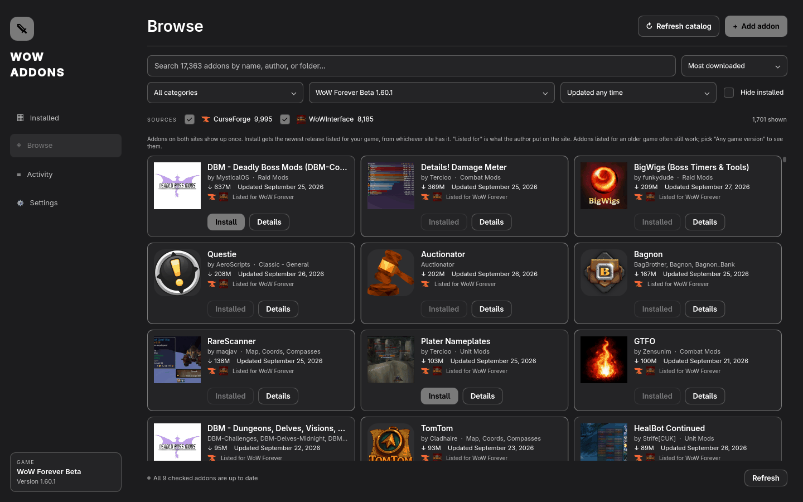
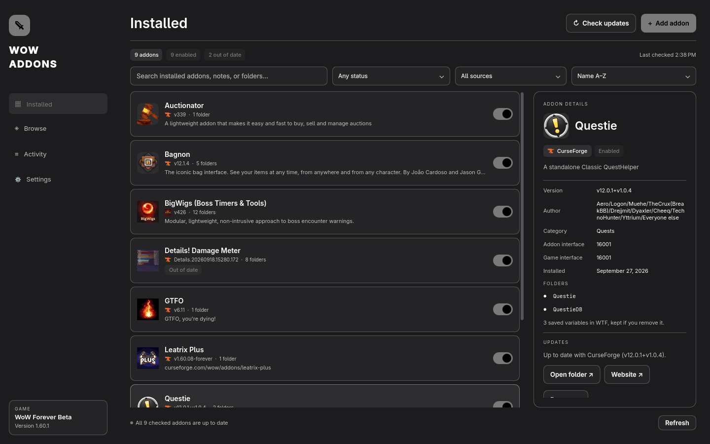

# WoW Addons

An addon manager for World of Warcraft on [Omarchy](https://omarchy.org). Browse addons from CurseForge and WoWInterface, install them in one click, and keep them up to date. You don't need the CurseForge app or an account.



## Install

You need Omarchy 4 or newer. It already has everything the app uses (Quickshell and Python), so there's nothing else to install.

```bash
git clone https://github.com/ztrek7/omarchy-wow-addons
cd omarchy-wow-addons
python3 scripts/install.py
```

Open **WoW Addons** from the app launcher (Super + Space).

To remove the app later, run `python3 scripts/install.py --uninstall`. Your addons stay where they are.

## How it works



**Finding your game.** The app looks for World of Warcraft in Wine and Proton prefixes, such as the Battle.net install that comes with Omarchy. It lists every version it finds, like WoW Retail, WoW Classic, WoW Classic Era, WoW Forever, and their PTRs and betas. Switch between them from the menu in Browse or in Settings. If your game is somewhere unusual, point the app at the folder in Settings.

**Browsing.** Browse lists about 17,000 addons from CurseForge and WoWInterface together. An addon that's on both sites shows up once, with a logo for each site. You can search, filter by category or last update, hide what you already have, and sort by downloads, date, or name. It only shows addons the site lists for the game you picked, unless you choose "Any game version". Each card says which game the addon is listed for, taken straight from the site. Addons listed for an older game often still work, but the app won't claim they were made for yours. Either site can be turned off.

**Installing.** Install gets the newest stable release listed for your game, from whichever site has it. If the addon needs other addons to work, those get installed too. If something is already in the way, the old copy goes to the trash first.

**Updating.** The app checks for updates when it opens and every six hours while it's open. You can update one addon or all of them. Addons you copied in by hand get checked too, as long as their files say which CurseForge or WoWInterface page they came from and that site lists them for your game. If the app can't tell whether a site's version is newer than yours, like 2.0 against 2.0-12-gabc123, it says so instead of offering it as an update.

**Turning addons off.** Turning an addon off moves its folder from `Interface/AddOns` to `Interface/AddOns.disabled`, so it's off for every character. Turning it back on moves it back. You can still turn addons on and off per character from the in-game AddOns list.

**Removing.** Removed addons go to the trash, so you can get them back. Your addon settings (in the game's `WTF` folder) are never touched.

WoW only loads addons at login. If the game is open, type `/reload` after making changes.

## Where the addons come from

Only CurseForge and WoWInterface, the two big addon sites. Files always download straight from them, and each download is checked against the size or checksum the site lists. Nothing comes from GitHub or other random links. You can also add a `.zip` you downloaded yourself.

WoWInterface has a public list of its addons. CurseForge only gives API keys to approved apps. So the CurseForge list comes from the public catalog the [instawow](https://github.com/layday/instawow-data) project publishes every day, plus [CFWidget](https://www.cfwidget.com/) for logos, details, and file lists. Other managers that don't ask for a key work the same way.

CFWidget's copy of a project occasionally stops updating. The app checks each file list against the catalog's last-updated date and won't install an old version from a stale copy. If WoWInterface has an up-to-date copy of the same addon, listed for your game, it installs that instead and tells you. If not, it says so, and you can download the addon from its page and add the `.zip`. The app never swaps in an older version just because it's available.

[Wago](https://addons.wago.io) isn't supported. Wago only gives download access to people with a paid API key. When an addon is also on Wago, its details link to the Wago page.

## Files it keeps

| What | Where |
| --- | --- |
| Settings (game folder, game version, sites) | `~/.config/wow-addons/config.json` |
| Which site each addon was installed from | `~/.local/share/wow-addons/state.json` |
| Addon catalog, refreshed every 6 hours | `~/.cache/wow-addons/` |
| The app itself | `~/.local/share/wow-addons/app` |

## Problems and ideas

Open an [issue](https://github.com/ztrek7/omarchy-wow-addons/issues/new/choose). The app can copy the details a report needs: Settings → Copy details for a report. Pull requests are welcome too; see [CONTRIBUTING.md](CONTRIBUTING.md).

## Development

The window is Qt Quick, run by Quickshell. It calls `backend.py` for anything that touches files or the network. `./run` starts the app from a checkout without installing it.

```bash
python3 -m unittest discover -s tests                 # Python tests, example data only
WOW_ADDONS_DEMO=1 quickshell -n -p "$PWD/Smoke.qml"   # UI test with example data
```

## License

MIT. The CurseForge and WoWInterface logos belong to those sites. They're only used to show where an addon comes from.

This project isn't affiliated with Blizzard Entertainment, CurseForge, WoWInterface, or Wago. World of Warcraft is a trademark of Blizzard Entertainment, Inc.
