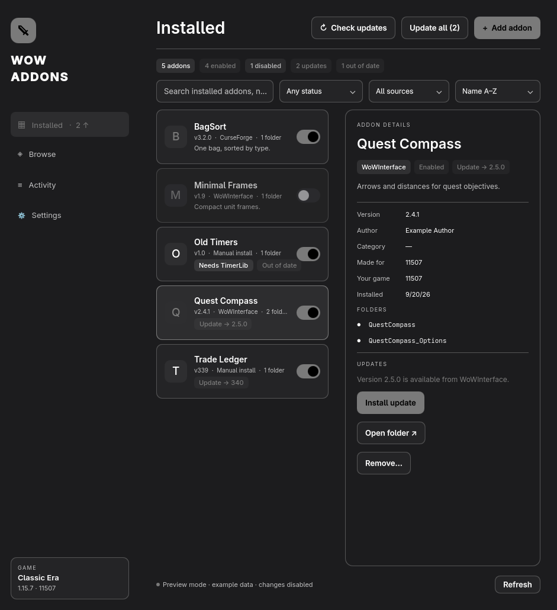

# WoW Addons for Omarchy

A native Omarchy app for World of Warcraft addons on Linux. Browse the two big moderated addon sites, CurseForge and WoWInterface, in one list. Install in a click, and keep addons enabled, updated, and complete, without the CurseForge app. It follows your active Omarchy theme and uses only Quickshell, Qt Quick, and the Python standard library.



*Preview rendered from built-in example data.*

- **Installed**: every addon in your AddOns folder, including ones you copied in by hand. Filter by status (enabled, disabled, update available, out of date, missing requirements) and source. Sort by name, install date, what needs attention, or folder count. Modules such as `DBM-Raids` are grouped under their core addon.
- **Browse**: CurseForge and WoWInterface in one list of about 17,000 addons. An addon listed on both sites appears once, with both sites' downloads added up. Install picks the more recently updated site with a build for your game, and the details view lets you choose the other. Turn either site on or off; both start on. Search by name, author, or folder, and filter by category, game version, and last update. You can also hide what's installed. Sort by downloads, recent updates, or name.
- **Requirements**: installing an addon also installs the addons it requires (its `.toc` `Dependencies`) from the same catalog, and turns on any that are disabled. Installed addons missing a requirement are flagged, with a button to fix it.
- **Updates**: checked automatically when the app opens and every 6 hours while it's open, or on demand with **Check updates**. Update one addon or all of them. Addons you installed by hand are checked too, when their `.toc` names their CurseForge or WoWInterface listing (`X-Curse-Project-ID`, `X-WoWI-ID`, or `X-Website`). Updating a hand install replaces its folder, and the addon is tracked from then on.
- **Add addon**: paste an addon's CurseForge or WoWInterface page, or pick a .zip you downloaded. Recent downloads are offered as one-click picks.
- **Disable and enable** in one click; **remove** to the trash.
- Finds Battle.net installs in Wine and Proton prefixes, and every game version inside them (`_retail_`, `_classic_`, `_classic_era_`, betas, and PTRs).

## Install

Requires Omarchy (for its Quickshell theme module), `quickshell`, and Python 3.11 or later. No pip or npm packages.

```bash
git clone https://github.com/ztrek7/omarchy-wow-addons
cd omarchy-wow-addons
python3 scripts/install.py
```

Then open **WoW Addons** from the app launcher (`Super` + `Space`). To try it without installing, run `./run` from the checkout. To remove the app and its launcher, run `python3 scripts/install.py --uninstall`. That leaves your addons alone.

Shortcuts: `Ctrl+F` search, `Ctrl+N` add an addon, `Ctrl+R` refresh, `Ctrl+1`/`Ctrl+2` switch between Installed and Browse, `Escape` close.

## How it changes your game folder

- **Disable** moves an addon's folders from `Interface/AddOns` to `Interface/AddOns.disabled`, so it's off for every character. The game rewrites `WTF/…/AddOns.txt` on logout, which would undo edits to that file. Moving folders survives that. **Enable** moves them back. The in-game AddOns list still handles per-character choices among enabled addons.
- **Remove** moves the folders to the desktop trash (`~/.local/share/Trash`), so you can restore them. Anything an install replaces goes to the trash too. SavedVariables in `WTF` are never touched.
- **Install** unpacks only real addon folders, meaning folders holding a `.toc` named after them. It refuses archives with absolute paths, `..`, or links. WoWInterface downloads are checked against their published MD5.
- The game reads addons at startup. When a WoW client is running, the app reminds you to `/reload` or restart.

An addon counts as **out of date** when its `## Interface` list doesn't include your client's interface number, for example 16001 for client 1.60.1. The app reads the flavor-specific `.toc` (`_Vanilla`, `_Classic`, `_Mainline`, and so on) that your client would load.

## Where things live

| What | Where |
| --- | --- |
| Chosen install folder, game version, and Browse sources | `~/.config/wow-addons/config.json` |
| Which addons came from which source and version | `~/.local/share/wow-addons/state.json` |
| Catalog caches, refreshed after 6 hours | `~/.cache/wow-addons/` |
| The installed app | `~/.local/share/wow-addons/app` |

Game folders are detected under `~/Games/*/drive_c`, `~/.wine`, and Steam's Proton prefixes. Pick another folder in **Settings**.

## Sources and privacy

The app downloads addons from CurseForge and WoWInterface only. Both sites host addons from their authors and moderate uploads. Nothing is installed from code repositories, file links, or other sites. The only other way to add an addon is a .zip you downloaded yourself. Neither site needs an account or API key.

| Site | How the app reads it | Downloads from |
| --- | --- | --- |
| CurseForge | The daily community catalog published by [instawow](https://github.com/layday/instawow-data) for browsing, and [CFWidget](https://www.cfwidget.com/) for details and file lists | CurseForge's CDN (`edge.forgecdn.net`), checked against the listed file size |
| WoWInterface | Its public API (`api.mmoui.com`) | `cdn.wowinterface.com`, checked against the published MD5 |

CurseForge's official API only issues keys to approved applications. The community catalog and CFWidget are built by people who hold such keys and publish the results openly. That's how other key-free managers work too. The catalog also records where else an addon is published. The app uses that only to recognize the same addon on both sites, never as a place to download from.

**Wago Addons** isn't a source. Its data API needs a key that Wago gives to paying supporters, and its `robots.txt` disallows automated downloads. When an addon is also on Wago, its details link to the Wago page. **Tukui** isn't a source either: it hosts just two addons.

The app uses no accounts, analytics, or root.

## Development

```bash
python3 -m unittest discover -s tests                        # backend tests, synthetic data only
WOW_ADDONS_DEMO=1 quickshell -n -p "$PWD/Smoke.qml"          # UI filters and sorting on example data
quickshell -n -p "$PWD/Verify.qml"                           # read-only check against your install
```

`backend.py` is the JSON bridge the window calls. `wowdir.py` finds installs and reads `.toc` files, `library.py` changes the AddOns folder, and `sources.py` talks to CurseForge and WoWInterface and unpacks archives, and `catalog.py` merges the two sites' lists for Browse.

Not affiliated with Blizzard Entertainment, CurseForge, WoWInterface, or Wago. World of Warcraft is a trademark of Blizzard Entertainment, Inc.
